# LambChat

<p align="center">
  
  
  
  
  
  
  
</p>

English | [简体中文](README_CN.md)

> A production-ready AI Agent system built with FastAPI + LangGraph

## 📸 Screenshots

### Main Interface

<table>
  <tr>
    <td align="center"><b>Login Page</b></td>
    <td align="center"><b>Chat Interface</b></td>
  </tr>
  <tr>
    <td>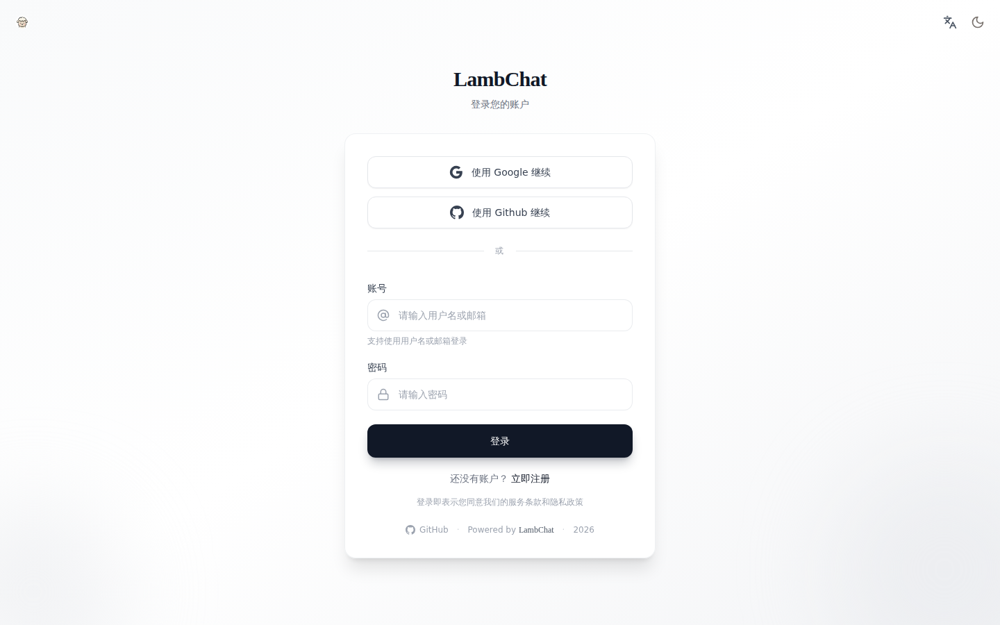</td>
    <td>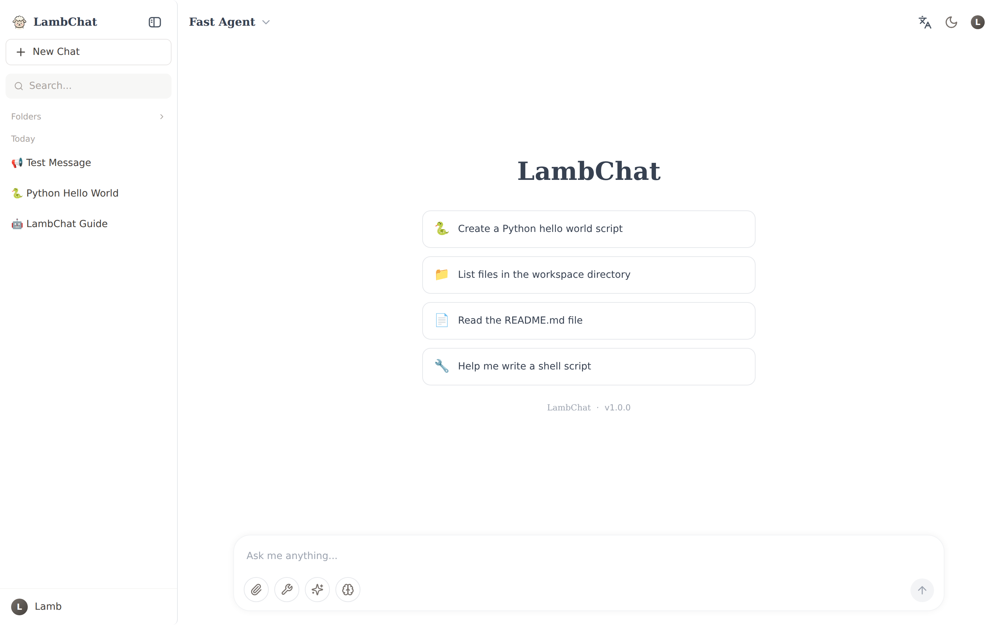</td>
  </tr>
  <tr>
    <td align="center"><b>Streaming Response</b></td>
    <td align="center"><b>Share Dialog</b></td>
  </tr>
  <tr>
    <td>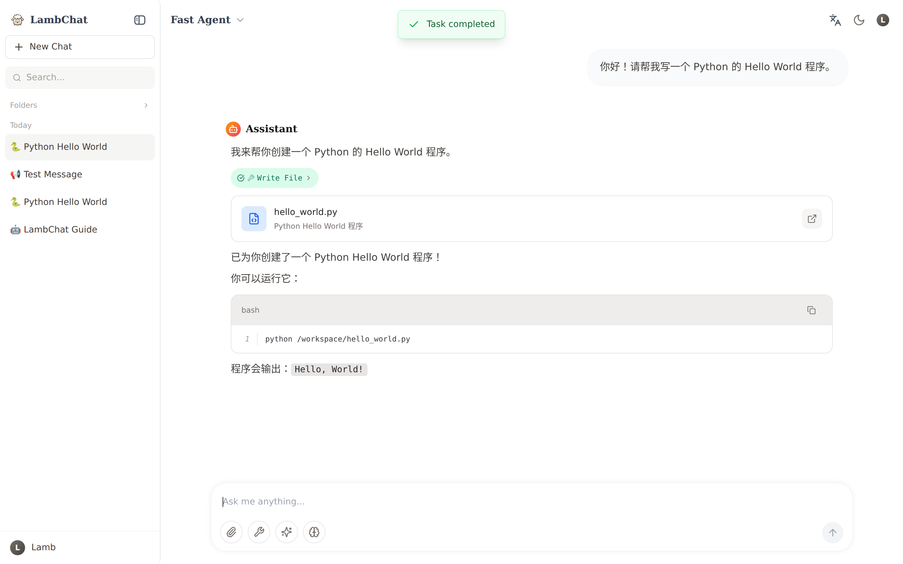</td>
    <td>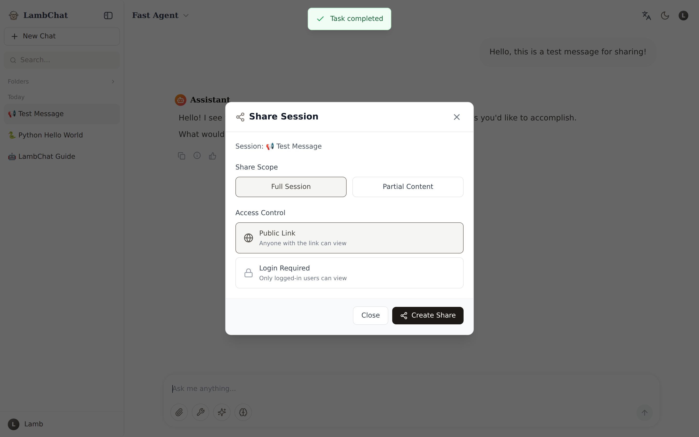</td>
  </tr>
</table>

### Management Panels

<table>
  <tr>
    <td align="center"><b>Skills Management</b></td>
    <td align="center"><b>MCP Configuration</b></td>
  </tr>
  <tr>
    <td>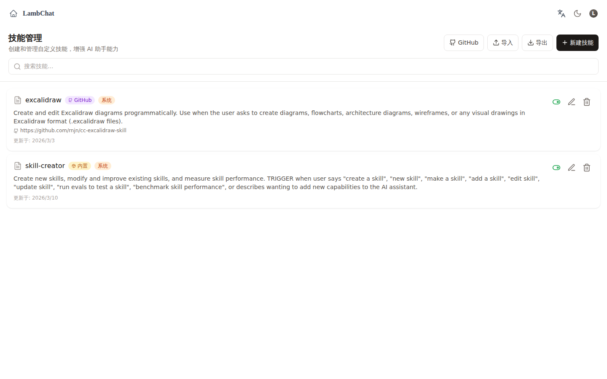</td>
    <td>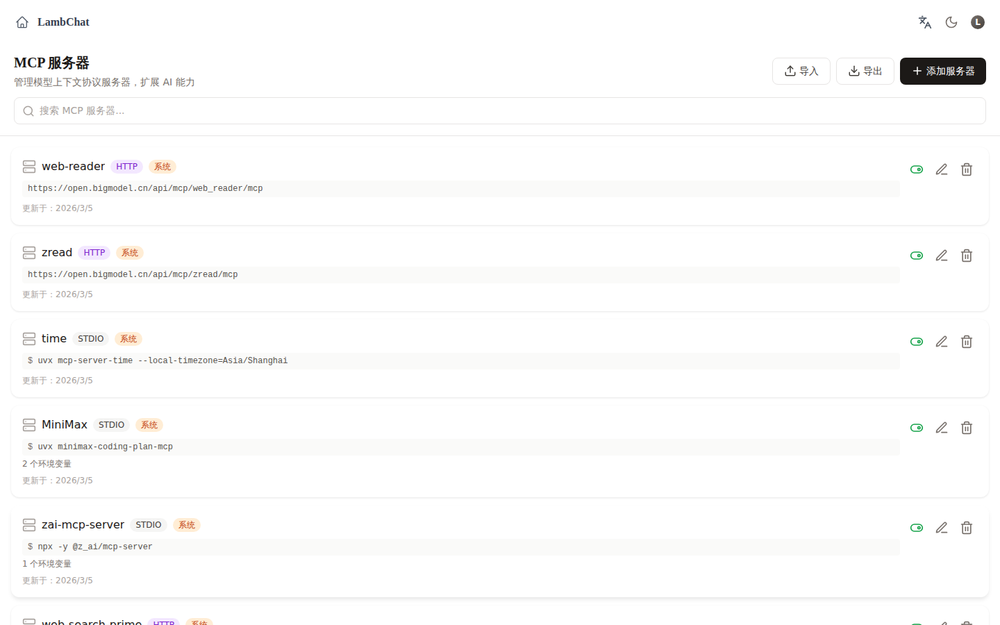</td>
  </tr>
  <tr>
    <td align="center"><b>System Settings</b></td>
    <td align="center"><b>Feedback System</b></td>
  </tr>
  <tr>
    <td>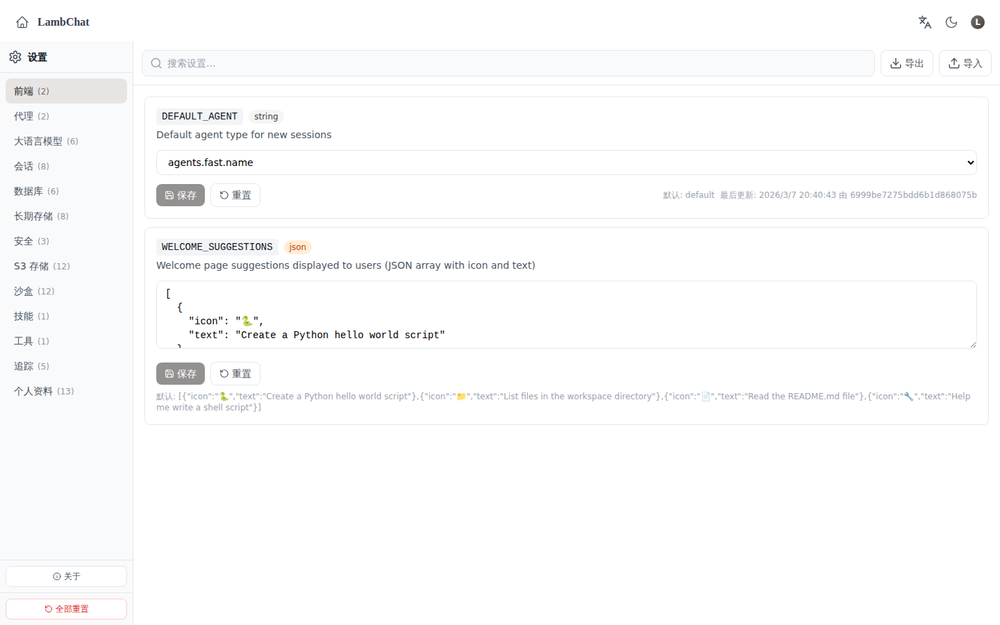</td>
    <td>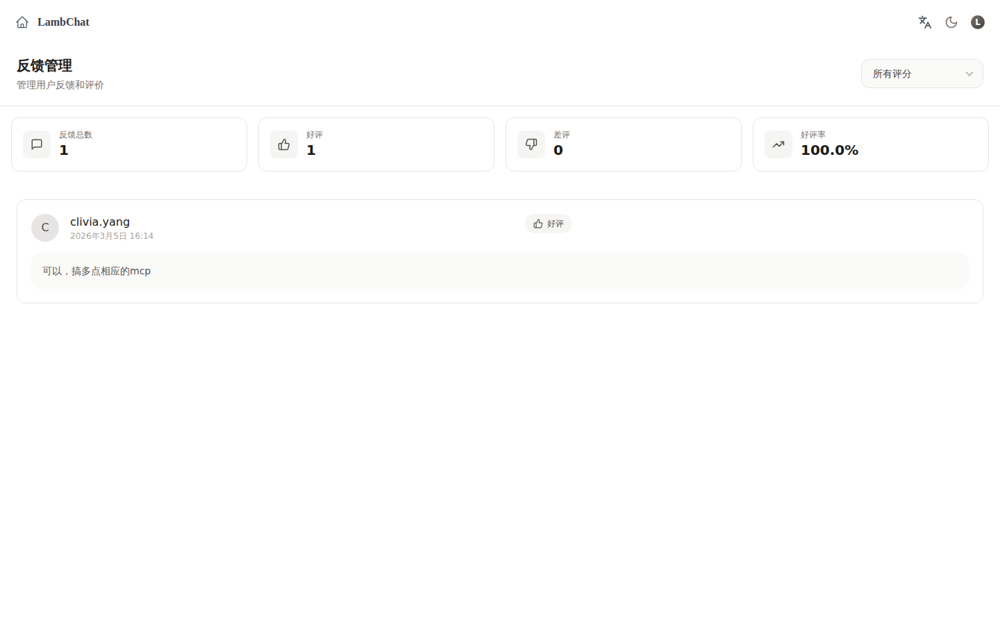</td>
  </tr>
  <tr>
    <td align="center"><b>Shared Session</b></td>
    <td align="center"><b>Role Management</b></td>
  </tr>
  <tr>
    <td>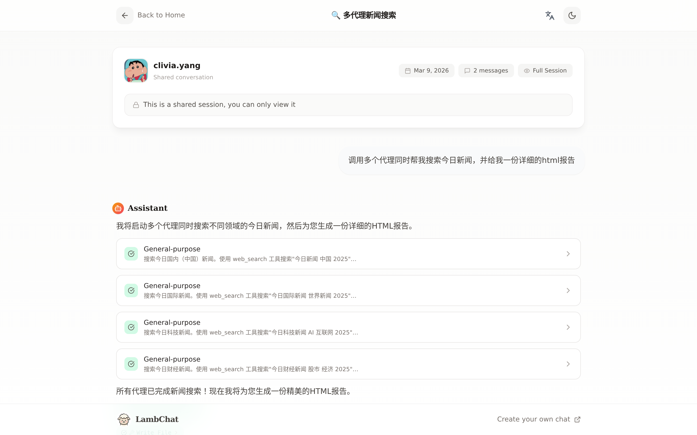</td>
    <td>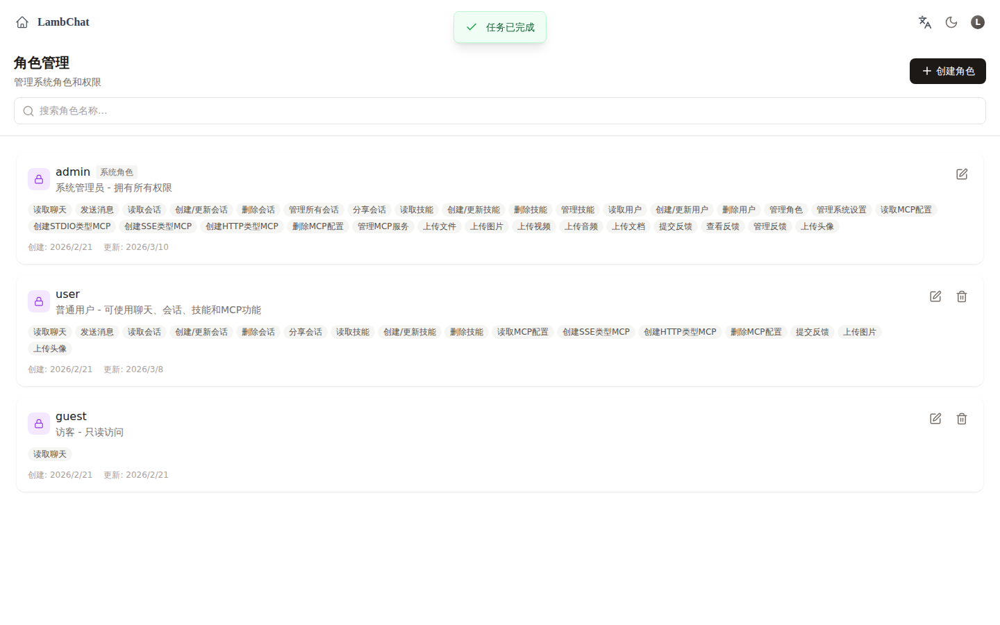</td>
  </tr>
</table>

### Responsive Design

<table>
  <tr>
    <td align="center"><b>Mobile View</b></td>
    <td align="center"><b>Tablet View</b></td>
  </tr>
  <tr>
    <td>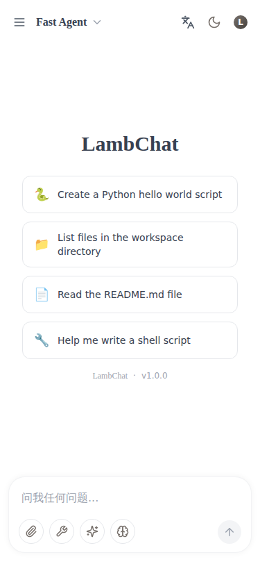</td>
    <td>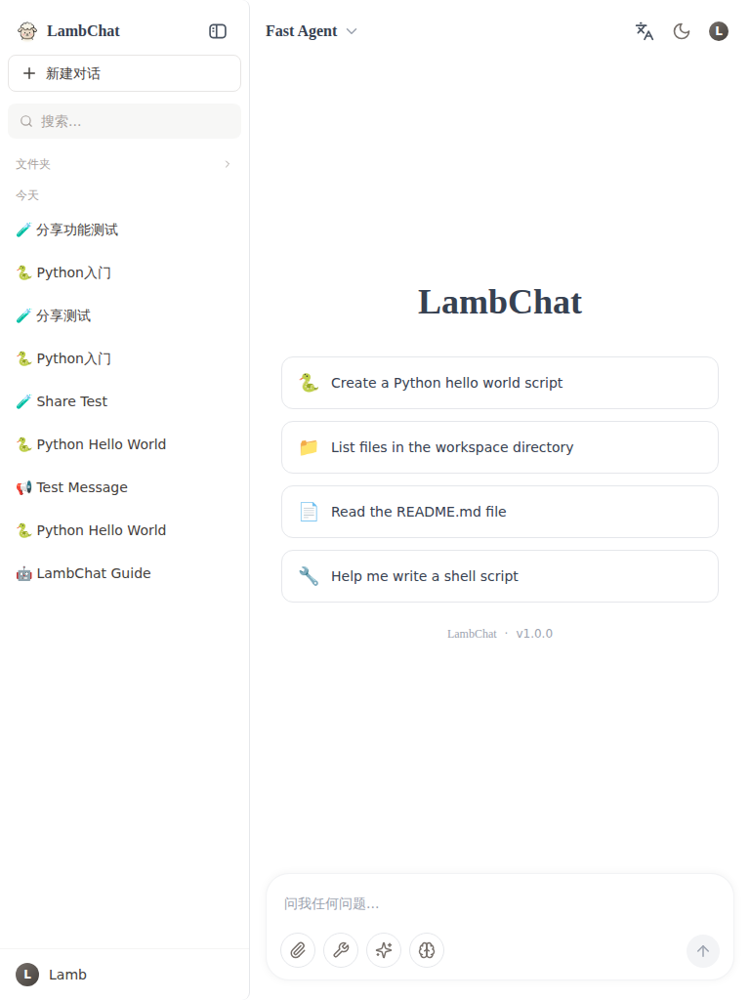</td>
  </tr>
</table>

## 🏗️ Architecture Overview

<p align="center">
  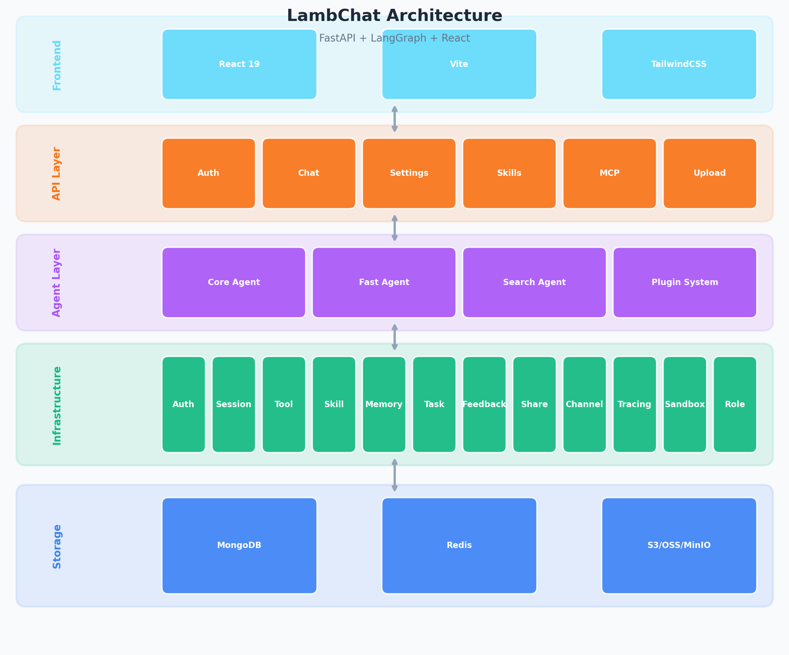
</p>

## ✨ Features

### 🤖 Agent System
- **LangGraph Architecture** - Compiled graph with fine-grained state management
- **Multi-Agent Types** - Core Agent (default), Fast Agent (optimized speed), Search Agent (web search)
- **Plugin System** - Register custom agents with `@register_agent("id")` decorator
- **Streaming Output** - Native SSE (Server-Sent Events) support
- **Sub-agents** - Multi-level agent nesting support
- **Thinking Mode** - Extended thinking mode for Anthropic models
- **Code Interpreter** - Built-in code execution with sandbox support
- **Human-in-the-Loop** - Approval system for sensitive operations

### 🧠 AI Vision & Image Tools
- **UI to Artifact** - Convert UI screenshots into frontend code, AI prompts, design specs, or descriptions
- **OCR Text Extraction** - Extract text from screenshots (code, terminal, docs, general text)
- **Error Screenshot Diagnosis** - Diagnose error messages, stack traces, and exception screenshots
- **Technical Diagram Understanding** - Analyze architecture diagrams, flowcharts, UML, ER diagrams
- **Data Visualization Analysis** - Extract insights from charts, graphs, and dashboards
- **UI Diff Check** - Compare two UI screenshots to identify visual differences
- **General Image Analysis** - Flexible image understanding for any visual content
- **Video Analysis** - Analyze video content (MP4/MOV/M4V, up to 8MB)

### 🔍 Web Search
- **Web Search Prime** - Search the web with rich results (title, URL, summary, site icon)
- **Domain Filtering** - Limit search results to specific domains
- **Time Range Filter** - Filter by day/week/month/year
- **Region Support** - Optimize for CN or US regions
- **Content Size Control** - Balanced (400-600 words) or comprehensive (2500 words) summaries

### 🔌 MCP Integration
- **System + User Level MCP** - Global and personal MCP server configs
- **Encrypted Storage** - Sensitive data like API keys are encrypted
- **Dynamic Caching** - Tool caching with manual refresh support
- **Multiple Transports** - Support for stdio, SSE, and HTTP transports
- **Permission Control** - Transport-level access permissions

### 🛠️ Skills System
- **Dual Storage** - File system + MongoDB backup
- **Access Control** - User-level skill permissions
- **GitHub Sync** - Sync custom skills from GitHub repositories
- **Skill Store** - Browse and install community skills
- **Skill Creator** - Built-in skill creation agent with evaluation tools
- **5 Skill Slots** - Enable up to 5 skills per session

### 💬 Feedback System
- **Thumbs Rating** - Simple positive/negative feedback
- **Text Comments** - Detailed user feedback
- **Session Linking** - Feedback tied to specific sessions/messages
- **Run-Level Stats** - Aggregate feedback statistics per run

### 📁 Document & File Support
- **Multi-format Preview** - PDF / Word / Excel / PPT / Markdown / Mermaid
- **Image Viewer** - Built-in image preview with zoom support
- **File Upload** - Drag & drop or click to upload multiple files
- **Cloud Storage** - S3 / OSS / MinIO integration
- **Folder Management** - Organize conversations into folders
- **Session Search** - Full-text search across all conversations

### 🔄 Real-time & Storage
- **Dual-write Mechanism** - Redis for real-time, MongoDB for persistence
- **WebSocket Support** - Real-time bidirectional communication
- **Auto Reconnect** - Resume conversation after disconnection
- **Session Sharing** - Share conversations with public or authenticated links
- **Message Search** - Full-text search across all conversations

### 🔐 Security & Auth
- **JWT Authentication** - Complete auth flow with token refresh
- **RBAC Roles** - Admin / User / Guest levels
- **Multi-tenancy** - Tenant-level resource isolation
- **Password Encryption** - bcrypt hashing
- **OAuth Support** - Login with Google, GitHub, etc.
- **Email Verification** - Secure email-based account verification
- **Sandbox Execution** - Isolated code execution environment

### ⚙️ Task Management
- **Concurrency Control** - Task execution queue with concurrency limits
- **Cancellation** - Cancel running tasks
- **Heartbeat** - Task health monitoring
- **Pub/Sub** - Event-driven task notifications
- **Status Tracking** - Real-time task status updates

### 🔗 Channels & Integrations
- **Feishu (Lark)** - Native integration with Lark/Feishu platform
- **Multi-Channel** - Extensible channel system for messaging platforms
- **Email Service** - Built-in email notification support
- **Project Management** - Organize chats by projects

### 📊 Observability & Admin
- **LangSmith Tracing** - LangSmith integration for agent tracing
- **Structured Logging** - Context-aware structured logging
- **Health Check** - API health and readiness endpoints
- **User Management** - View and manage users
- **Role Assignment** - Configure agent access per role
- **Audit Logging** - Track system activities

### 🎨 Frontend
- **Modern Stack** - React 19 + Vite + TailwindCSS
- **ChatGPT Style** - Familiar chat interface
- **Theme Support** - Dark/Light mode with smooth transitions
- **i18n** - Multi-language support (English, Chinese, more coming)
- **Responsive Design** - Mobile, tablet, and desktop optimized
- **PWA Ready** - Install as a progressive web app
- **Agent Switcher** - Toggle between Core/Fast/Search agents

## ⚙️ Configuration

LambChat supports 14 setting categories, configurable via the Settings page or environment variables:

| Category | Description |
|----------|-------------|
| **Frontend** | Default agent, welcome suggestions, UI preferences |
| **Agent** | Debug mode, logging level |
| **LLM** | Model selection, temperature, max tokens, API key & base URL |
| **Session** | Session management settings |
| **Database** | MongoDB connection settings |
| **Long-term Storage** | Persistent storage configuration |
| **Security** | Security policies and encryption |
| **S3** | Cloud storage (S3/OSS) configuration |
| **Sandbox** | Code sandbox settings |
| **Skills** | Skill system configuration |
| **Tools** | Tool system settings |
| **Tracing** | LangSmith and tracing configuration |
| **User** | User management settings |
| **Memory** | Memory system (hindsight) settings |

## 🛠️ Development

### Prerequisites
- Python 3.12+
- Node.js 18+
- MongoDB
- Redis

### Quick Start

```bash
# Clone repository
git clone https://github.com/Yanyutin753/LambChat.git
cd LambChat

# Copy environment file
cp .env.example .env
# Edit .env with your configuration

# Start with Docker (recommended)
docker-compose up -d

# Or run locally
make install  # Install dependencies
make dev      # Start development server
```

Access the app at `http://localhost:8000`

### Code Quality

```bash
# Format code
ruff format src/

# Check style
ruff check src/

# Type check
mypy src/
```

### Project Structure

```
src/
├── agents/          # Agent implementations (core, fast, search)
├── api/             # FastAPI routes and middleware
├── infra/           # Infrastructure services
│   ├── auth/        # JWT authentication
│   ├── backend/     # Backend management
│   ├── channel/     # Multi-channel (Feishu, etc.)
│   ├── email/       # Email service
│   ├── feedback/    # Feedback system
│   ├── folder/      # Folder management
│   ├── llm/         # LLM integration
│   ├── memory/      # Memory & hindsight
│   ├── mcp/         # MCP protocol
│   ├── patches/     # Monkey patches and compat fixes
│   ├── role/        # RBAC role management
│   ├── sandbox/     # Sandbox execution
│   ├── session/     # Session management (dual-write)
│   ├── settings/    # Settings service
│   ├── share/       # Session sharing
│   ├── skill/       # Skills system
│   ├── storage/     # File storage
│   ├── task/        # Task management
│   ├── tool/        # Tool registry & MCP client
│   ├── tracing/     # LangSmith tracing
│   ├── user/        # User management
│   └── websocket/   # WebSocket support
├── kernel/          # Core schemas, config, types
└── skills/          # Built-in skills (skill-creator)
```

## 🤝 Contributing

We welcome contributions! Please see [CONTRIBUTING.md](CONTRIBUTING.md) for guidelines.

## 📄 License

[MIT](LICENSE)

---

<p align="center">
  Made with ❤️ by <a href="https://github.com/Yanyutin753">Clivia</a>
</p>
